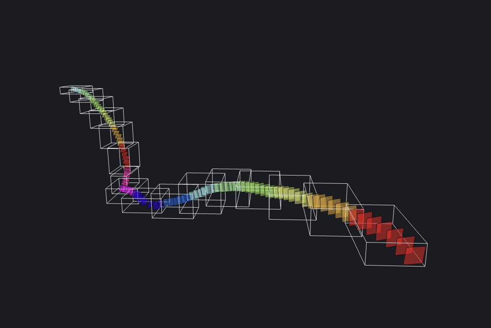
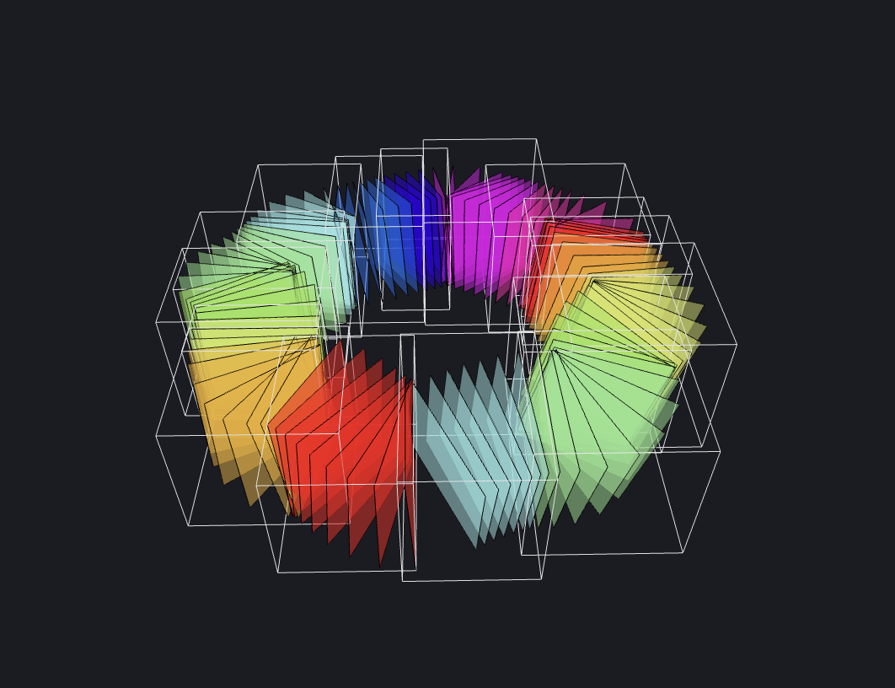

# Ouroboros

`or-uh-bore-us`

Extract ROIs from cloud-hosted medical scans.

Ouroboros is a desktop app (built with Electron) and a Python package (with a CLI). 

The desktop app uses Docker to build and run its Python server. For this reason, **Docker is required** to run Ouroboros.

If you are interested in using the Python package for its CLI or for a custom usecase, check out the [python](https://github.com/We-Gold/ouroboros/tree/main/python) folder in the main repository.

Ouroboros also has a [Plugin System](./guide/plugins.md). Plugin servers are also run in Docker.

## Usage Guide

_It is recommended that you read these pages in order._

- [Download and Install Ouroboros](./guide/downloading.md)
- [Slicing](./guide/slicing.md)
- [Backprojection](./guide/backproject.md)
- [Plugins](./guide/plugins.md)

## Reference

- [Technical Constants](./reference/technical-constants.md) - hardcoded
  file explorer limits and plugin broadcast behavior.

## Large Folder Behavior

The Ouroboros File Explorer is designed to open scan and output folders
directly, but it is not a general-purpose file browser. It loads
subfolders on demand: opening a folder shows only that folder's direct
entries, and subfolder contents stream in when you expand each subfolder.
When you point it at a folder that contains many files or deeply nested
subfolders, the following behavior applies:

- Only the root's direct entries are loaded up front. Nested subfolders
  are loaded and watched only when you expand them.
- Collapsing a subfolder keeps its state and watcher alive for a short
  window (thirty seconds by default) so quickly re-expanding is free. If
  you leave it collapsed past that window, the underlying watcher is torn
  down and the subfolder's cached children are dropped from renderer
  state; re-expanding later behaves like a fresh load.
- The panel stops loading new paths after one hundred thousand visible
  entries across all currently open watchers. When this happens,
  Ouroboros shows a warning toast asking you to pick a smaller folder or
  expand the folder in smaller pieces.
- `node_modules`, `__pycache__`, `venv`, and any directory whose name
  starts with `.` are always skipped.

See [Technical Constants](./reference/technical-constants.md) for the
exact values, why they were chosen, and when to adjust them.

## Ouroboros Explanation

A user of Ouroboros may have a multi-terabyte volumetric scan, hosted with the Neuroglancer family of tools (i.e. [cloud-volume](https://github.com/seung-lab/cloud-volume)). 

Perhaps there is a long, relatively sparse structure (ROI), like a nerve or a blood vessel that crosses the entire scan. Even with a well-equipped computer, it would be difficult to segment the entire stucture in one pass due to RAM limitations.

Ouroboros provides a solution. A user first traces the structure in Neuroglancer with sequential annotation points, and then saves the JSON configuration to a file.

Ouroboros opens this configuration file and cuts rectangular slices along the annotation path, producing a straightened volume with the ROI at the center of each slice (usually much smaller than the original scan).

_Every tenth slice in a circular annotation path, rendered in Ouroboros's Slicing Page._

From there, the user segments the much smaller straightened volume with their choice of segmentation system. Then, Ouroboros [backprojects](./guide/backproject.md) the segmented slices into the original volume space (unstraightens it), producing a full segmentation.